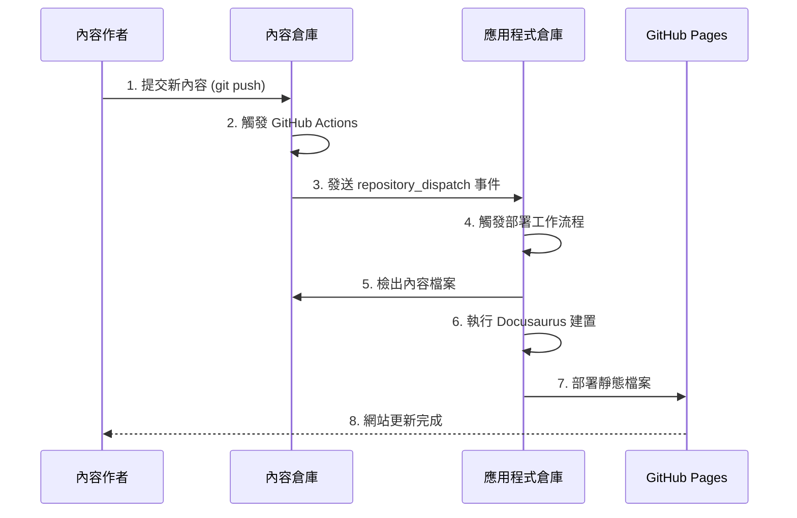

# 系統架構文件 - 方案 A：雙 Repository + repository_dispatch 架構

**專案代號：** Blog-KnowledgeBase-v1  
**架構方案：** 解決方案 A (推薦)  
**文件版本：** 1.0  
**建立日期：** 2025年9月2日  
**工具選擇：** Docusaurus + GitHub Actions + GitHub Pages

---

## 1. 架構概覽

### 1.1 架構目標
- **內容與程式碼完全分離**：實現內容創作者與開發者的獨立工作流程
- **自動化部署機制**：內容更新時自動觸發網站重新建置與部署
- **高可用性與性能**：利用靜態網站生成器提供快速載入體驗
- **成本效益**：基於免費的 GitHub 生態系統實現完整解決方案

### 1.2 核心架構組件

```
┌─────────────────┐    repository_dispatch    ┌──────────────────────┐
│   內容倉庫      │ ────────────────────────► │    應用程式倉庫      │
│ (Content Repo)  │                           │   (App Repo)         │
│                 │                           │                      │
│ ├─ blog/        │                           │ ├─ src/              │
│ ├─ docs/        │                           │ ├─ static/           │
│ ├─ .github/     │                           │ ├─ docusaurus.config │
│ └─ README.md    │                           │ ├─ package.json      │
└─────────────────┘                           │ └─ .github/workflows │
                                              └──────────────────────┘
                                                        │
                                                        │ Deploy
                                                        ▼
                                              ┌──────────────────────┐
                                              │    GitHub Pages      │
                                              │                      │
                                              │ 靜態網站託管服務     │
                                              │ https://username.    │
                                              │ github.io/repo-name  │
                                              └──────────────────────┘
```

## 2. 詳細系統架構

### 2.1 內容倉庫 (Content Repository)

**功能職責：**
- 存放所有 Markdown/MDX 內容檔案
- 管理內容的版本控制與協作
- 觸發內容更新事件

**目錄結構：**
```
content/
├─ .github/
│  └─ workflows/
│     └─ trigger-deploy.yml     # 觸發部署的工作流程
├─ blog/                        # 部落格文章
│  ├─ 2025/
│  │  └─ 09/
│  │     └─ 02/
│  │        └─ welcome.md
│  └─ authors.yml              # 作者資訊
├─ docs/                       # 知識庫文件
│  ├─ getting-started/
│  │  ├─ introduction.md
│  │  └─ installation.md
│  └─ advanced/
│     └─ configuration.md
├─ static/                     # 靜態資源 (圖片、檔案)
│  └─ img/
└─ README.md                   # 內容倉庫說明
```

**GitHub Actions 配置 (.github/workflows/trigger-deploy.yml)：**
```yaml
name: Trigger Website Deploy

on:
  push:
    branches: [ main ]
  pull_request:
    branches: [ main ]
    types: [ closed ]

jobs:
  trigger-deploy:
    if: github.event_name == 'push' || (github.event_name == 'pull_request' && github.event.pull_request.merged == true)
    runs-on: ubuntu-latest
    steps:
      - name: Trigger deployment
        uses: peter-evans/repository-dispatch@v2
        with:
          token: ${{ secrets.REPO_DISPATCH_TOKEN }}
          repository: ${{ vars.APP_REPO_NAME }}
          event-type: content-updated
          client-payload: |
            {
              "ref": "${{ github.ref }}",
              "sha": "${{ github.sha }}",
              "content_repo": "${{ github.repository }}"
            }
```

### 2.2 應用程式倉庫 (App Repository)

**功能職責：**
- 位址： 本目錄下的 docusaurus
- 存放 Docusaurus 應用程式程式碼
- 接收內容更新觸發事件
- 執行網站建置與部署流程
- 管理網站設定與主題

**目錄結構：**
```
docusaurus/
├─ .github/
│  └─ workflows/
│     └─ deploy.yml             # 主要部署工作流程
├─ src/
│  ├─ components/              # React 元件
│  ├─ css/                     # 自訂樣式
│  └─ pages/                   # 自訂頁面
├─ static/                     # 靜態資源
├─ docusaurus.config.js        # Docusaurus 設定檔
├─ sidebars.js                 # 側邊欄設定
├─ package.json                # 依賴管理
├─ .nojekyll                   # GitHub Pages 設定
└─ README.md
```

**主要設定檔案：**

**docusaurus.config.js：**
```javascript
module.exports = {
  title: 'My Blog & Knowledge Base',
  tagline: 'Powered by Docusaurus',
  url: 'https://username.github.io',
  baseUrl: '/app-repo-name/',
  
  // GitHub Pages 部署設定
  organizationName: 'username',
  projectName: 'whyblog-docusaurus',
  deploymentBranch: 'gh-pages',
  trailingSlash: false,

  // 內容來源設定
  presets: [
    [
      'classic',
      {
        docs: {
          sidebarPath: require.resolve('./sidebars.js'),
          path: './content/docs',
        },
        blog: {
          path: './content/blog',
          showReadingTime: true,
        },
        theme: {
          customCss: require.resolve('./src/css/custom.css'),
        },
      },
    ],
  ],

  // 搜尋功能
  themes: [
    [
      require.resolve("@easyops-cn/docusaurus-search-local"),
      {
        hashed: true,
        language: ["en", "zh"],
      },
    ],
  ],
};
```

### 2.3 GitHub Actions 自動化工作流程

**主要部署流程 (.github/workflows/deploy.yml)：**

```yaml
name: Deploy to GitHub Pages

on:
  repository_dispatch:
    types: [content-updated]
  workflow_dispatch:

permissions:
  contents: read
  pages: write
  id-token: write

concurrency:
  group: "pages"
  cancel-in-progress: false

env:
  CONTENT_REPO: ${{ github.event.client_payload.content_repo || 'username/content-repo' }}

jobs:
  build:
    runs-on: ubuntu-latest
    steps:
      - name: Checkout app repository
        uses: actions/checkout@v4

      - name: Checkout content repository
        uses: actions/checkout@v4
        with:
          repository: ${{ env.CONTENT_REPO }}
          token: ${{ secrets.CONTENT_REPO_TOKEN }}
          path: ./content

      - name: Setup Node.js
        uses: actions/setup-node@v4
        with:
          node-version: '18'
          cache: 'npm'

      - name: Install dependencies
        run: npm ci

      - name: Build website
        run: npm run build

      - name: Setup Pages
        uses: actions/configure-pages@v4

      - name: Upload artifact
        uses: actions/upload-pages-artifact@v3
        with:
          path: ./build

  deploy:
    environment:
      name: github-pages
      url: ${{ steps.deployment.outputs.page_url }}
    runs-on: ubuntu-latest
    needs: build
    steps:
      - name: Deploy to GitHub Pages
        id: deployment
        uses: actions/deploy-pages@v4
```

## 3. 系統整合與資料流

### 3.1 內容更新流程



### 3.2 權限與安全性配置

**必要的 GitHub Secrets/Variables：**

**內容倉庫 (Content Repo) 設定：**
- `REPO_DISPATCH_TOKEN`: Personal Access Token (具備 public_repo 權限)
- `APP_REPO_NAME`: 變數，應用程式倉庫名稱 (格式: junsuwhy/whyblog-content)

**應用程式倉庫 (App Repo) 設定：**
- `CONTENT_REPO_TOKEN`: Personal Access Token (具備讀取內容倉庫權限)
- GitHub Pages 權限：在 Settings > Actions > General 中啟用 "Read and write permissions"

### 3.3 網域與 URL 結構

**URL 結構設計：**
```
https://junsuwhy.github.io/whyblog-docusaurus/
├─ /                           # 首頁
├─ /blog/                      # 部落格首頁
├─ /blog/2025/09/02/welcome    # 個別部落格文章
├─ /docs/                      # 文件首頁
├─ /docs/getting-started/      # 文件分類
└─ /docs/getting-started/intro # 個別文件頁面
```

## 4. 效能與最佳化策略

### 4.1 建置效能最佳化

- **增量建置**: 利用 GitHub Actions 快取機制減少重複建置時間
- **並行處理**: 內容檢出與依賴安裝同步進行
- **資源最佳化**: 自動壓縮 CSS/JS，最佳化圖片格式

### 4.2 執行期效能

- **靜態生成**: 所有頁面預先生成，無伺服器處理時間
- **CDN 分發**: GitHub Pages 內建全球 CDN
- **快取策略**: 瀏覽器快取與服務端快取最佳化

## 5. 監控與維護

### 5.1 系統監控指標

**建置監控：**
- 建置成功率
- 建置時間
- 部署頻率

**網站效能監控：**
- 頁面載入時間
- Core Web Vitals 指標
- 搜尋功能效能

### 5.2 故障排除與備援

**常見問題處理：**
1. repository_dispatch 未觸發：檢查權限設定與 token 有效性
2. 內容檢出失敗：驗證 CONTENT_REPO_TOKEN 權限
3. 建置失敗：檢查 Docusaurus 設定與內容格式

**備援機制：**
- 手動觸發部署 (workflow_dispatch)
- 本地建置與部署流程
- 內容倉庫備份策略

**本地環境設計：**
- 本地開發環境是建立在 VM 中，因此若建立網頁伺服器要測試，不是 `localhost` ，而是用 `192.168.56.102`

## 6. 擴展性設計

### 6.1 水平擴展能力

- **多內容來源**: 支援從多個內容倉庫整合內容
- **多語言支援**: Docusaurus 內建 i18n 功能
- **自訂元件**: MDX 支援自訂 React 元件

### 6.2 整合能力

- **第三方服務**: 評論系統 (Giscus)、分析工具 (Google Analytics)
- **API 整合**: 透過 MDX 元件整合外部 API
- **搜尋增強**: 可升級到 Algolia DocSearch

## 7. 成本分析

### 7.1 運營成本

- **GitHub**: 免費 (公開倉庫)
- **GitHub Pages**: 免費 (每月 100GB 頻寬)
- **GitHub Actions**: 每月 2000 分鐘免費額度
- **網域名稱**: 選配 (約 $10-20/年)

### 7.2 維護成本

- **開發維護**: 低 (架構穩定，少量程式碼)
- **內容管理**: 低 (Markdown 格式，Git 版本控制)
- **系統更新**: 低 (Docusaurus 定期更新即可)

---

此架構設計提供了一個穩定、高效且成本效益良好的解決方案，完全符合 PRD 中提出的所有核心需求，並為未來的功能擴展留下了充足的空間。